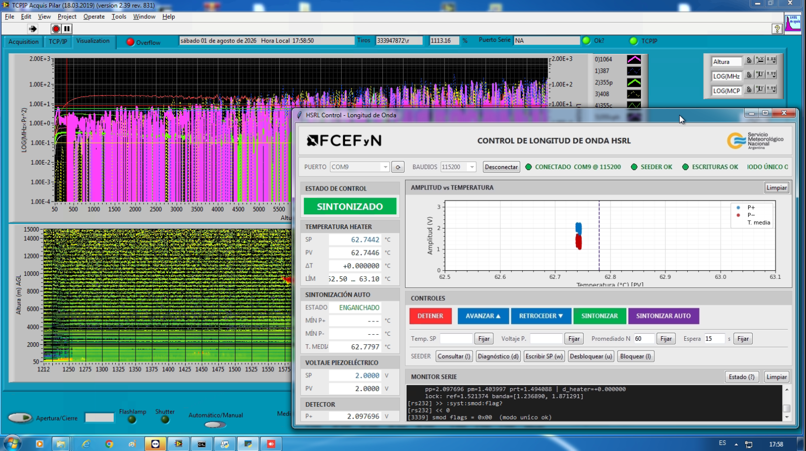
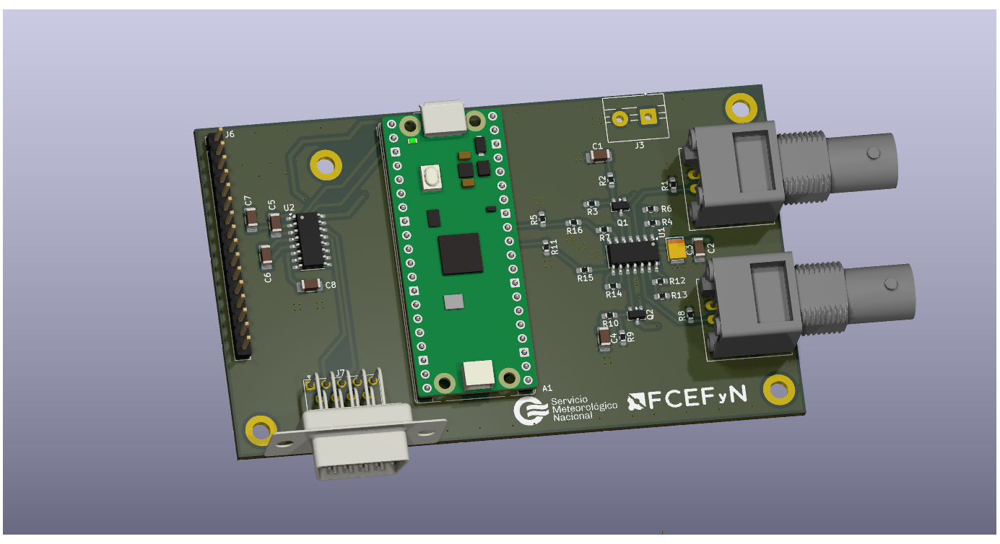

# hsrl-control-pi

<p align="center">
  
  
</p>

Sistema automatizado de control de longitud de onda para un lidar de alta
resolución espectral (HSRL). Proyecto Integrador — Ingeniería Electrónica,
FCEFyN, Universidad Nacional de Córdoba.

El sistema reemplaza el lazo de sintonización original del instrumento —
basado en un osciloscopio y una PC de escritorio — por una placa electrónica
dedicada con microcontrolador RP2350, que digitaliza los canales del detector,
cierra el lazo de control sobre el *seeder* del láser y expone una consola de
operación por USB.

Este repositorio agrupa el informe y, como submódulos de Git, los tres
desarrollos que componen el proyecto: la placa, el firmware y la interfaz.

## Estructura

```
hsrl-control-pi/
├── informe/          Informe final en LaTeX (ver informe/README.md)
├── pcb/              [submódulo] Diseño del hardware
│   ├── kicad/          Esquemáticos y PCB (KiCad 9.0)
│   ├── sim/            Simulaciones ngspice del detector de picos
│   └── signals/        Capturas de osciloscopio de los ensayos
├── rpico2/           [submódulo] Firmware del RP2350 (C, Pico SDK)
│   ├── hsrl-control.c  Programa principal y consola de comandos
│   ├── adc_capture.*   Adquisición sincronizada con el disparo del láser
│   ├── control.*       Lazo de sintonización y protecciones
│   └── seeder_comm.*   Enlace serie con el seeder Continuum
├── hmi/              [submódulo] Interfaz de operación (Python + Tkinter)
│   ├── hmi.py          Pantalla principal y ciclo de sondeo
│   ├── serie.py        Puerto serie y concurrencia
│   ├── telemetria.py   Modelo del proceso y parseo de la telemetría
│   └── registro.py     Registro CSV y log de sesión
├── hojas-de-datos/   Hojas de datos de los componentes principales
└── simulacion/       Simulaciones preliminares del circuito de detección
```

Cada submódulo tiene su propio README con instrucciones de compilación y uso.

## Clonado

Los submódulos apuntan a repositorios separados, de modo que hay que
inicializarlos explícitamente:

```bash
git clone --recurse-submodules https://github.com/FGalvagno/hsrl-control-pi
```

Si el repositorio ya fue clonado sin la opción anterior:

```bash
git submodule update --init --recursive
```

## Compilación del informe

Requiere una distribución TeX completa (TeX Live o MiKTeX) con `biber`:

```bash
cd informe
latexmk -pdf main.tex
```

El PDF resultante queda en `informe/main.pdf`.

## Repositorios de los submódulos

| Componente | Repositorio |
|---|---|
| Placa de control | https://github.com/FGalvagno/hsrl-control-board |
| Firmware RP2350 | https://github.com/FGalvagno/hsrl-control-rpico2 |
| Interfaz de operación | https://github.com/FGalvagno/hsrl-control-hmi |
